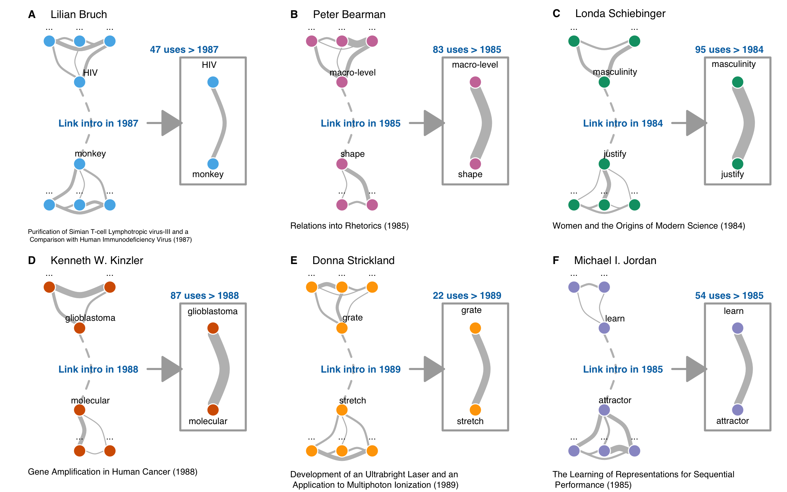
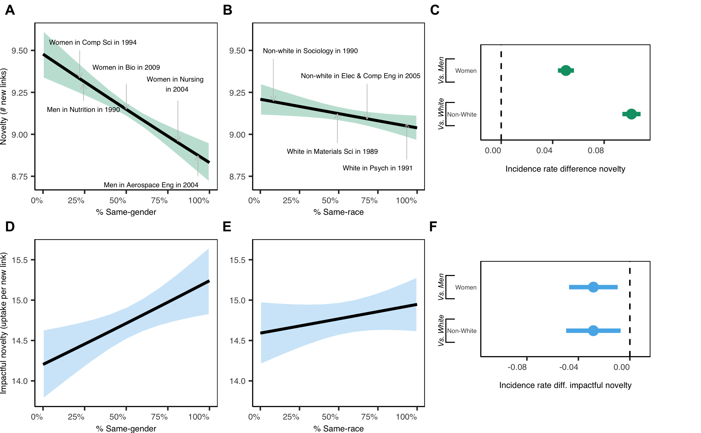
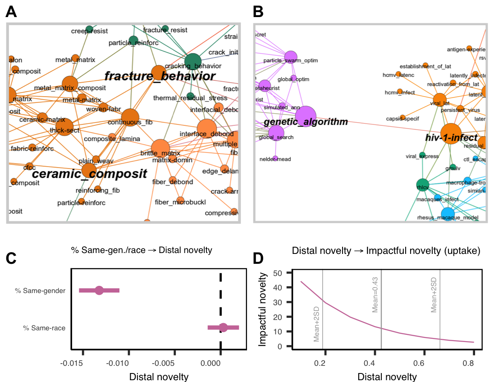
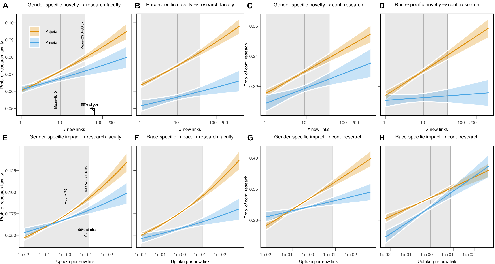

```{r setup, include=FALSE}
knitr::opts_chunk$set(echo = TRUE)
```


This repository contains code and data associated with "The Diversity-Innovation Paradox in Science." arXiv  preprint and PDF can be found [here](https://arxiv.org/abs/1909.02063).

## Paper 

By analyzing data from nearly all US PhD-recipients and their dissertations across three decades, this paper finds demographically underrepresented students innovate at higher rates than majority students, but their novel contributions are discounted and less likely to earn them academic positions. The discounting of minorities’ innovations may partly explain their underrepresentation in influential positions of academia.


**Figure 1**. The introduction of innovations and their subsequent uptake. 

(A-F) Examples drawn from the data illustrate our measures of novelty and impactful novelty. Nodes represent concepts and edge thickness indicates the frequency of their co-usage. Students can introduce new links (dotted lines) as their work enters the corpus. These examples concern novel links taken up at significantly higher rates than usual (e.g., 95 uses of Schiebinger’s link after 1984). The mean (median) uptake of new links is .790 (333), and ~50% of new links never gets taken up. (A) Lilian Bruch was among the pioneering HIV researchers (30) and her thesis introduced the link between “HIV” and “monkeys”, indicating innovation in scientific writing as HIV’s origins are often attributed to non-human primates. (C) Londa Schiebinger was the first to link “masculinity” with “justify,” reflecting her pioneering work on gender bias in academia (31). (E) Donna Strickland won the 2018 Nobel Prize in Physics for her PhD work on chirped pulse amplification, utilizing grating-based stretchers and compressors (32).


**Figure 2**. Gender and race representation relate to novelty and impactful novelty.

(A) Introduction of novelty (# new links) by the percentage of peers with a similar gender in a discipline (N = 808,375). Specifically, the results suggest that the more students’ own gender is underrepresented, the more novelty they introduce. (B) Similarly, the more students’ own race is underrepresented, the more novelty they introduce. (C) Binary gender and race indicators suggest that historically underrepresented groups in science (women, non-white scholars) introduce more novelty (i.e., their incidence rate is higher). (D) In contrast, impactful novelty decreases as students have fewer peers of a similar gender and suggests underrepresented genders have their novel contributions discounted (N = 345,257). (E) There is no clear relation between racial representation in a discipline and impactful novelty. (F) Yet, the novel contributions of women and non-white scholars are taken up less by others than those of men and white students (their incidence rate is lower).



**Figure 3**. Underrepresented genders introduce distal novelty, and distal novelty has less impact.

(A-B) Communities (colors) of concepts and their linkages. (A) The link between “fracture_behavior” and “ceramic_composition” arises within a semantic cluster. Both concepts are proximal in the embedding space of scientific concepts, and as such, their distal novelty score is low. (B) In contrast, the conceptual link between “genetic_algorithm” and “hiv-1” spans distinct clusters in the semantic network. As such, the concepts are distal in the embedding space of scientific concepts, and their distal novelty score is high. (C) Students of an overrepresented gender introduce more proximal novelty, and students from an underrepresented gender introduce more distal novelty in their theses. (D) In turn, the average distance of new links introduced in a thesis is negatively related to their future uptake.



**Figure 4**. The novelty and impactful novelty minorities introduce has discounted returns for their careers.
(A-D) Correlation of gender- and race-specific novelty with becoming research faculty or continued researcher (N = 805,236). As novelty increases, the probabilities of becoming faculty (for gender and race) and continuing research (for race) has diminished returns for minorities. For instance, a 2SD increase from the median level of novelty (# new links) increases the difference in probability to become research faculty between gender minorities and majorities from 3.5% to 9.5%. (E-F) Correlation of gender- and race-specific impactful novelty with becoming research faculty and a continued researcher (when novelty is nonzero, N = 628,738). With increasing impactful novelty, the probabilities of becoming faculty (for gender and race) and continuing research (for gender) start to diverge at the expense of the career chances of minorities. For instance, a 2SD increase from the median of impactful novelty (uptake per new link) increases the difference in probability of becoming research faculty between gender minorities and majorities from 4.3% to 15%.
 


## Code

With the provided code provided the novelty, impactful novelty, and distal novelty metrics can be constructed from the ProQuest dissertation abstract data.

- ***stms_estimate_at_K.R***: Runs Structural Topic Models at specified range of K (50-1000 in the paper).
- ***concepts_k500_50.R***: Extracts concepts from the structural topic model output, the number of words, topics, and FREX weighing can be adjusted in the code to get at the differend K/FREX scenarios.
- ***novelty and impactful novelty***: 
- ***embeddings***:

## Data

For the concepts extracted for the K = 500 Structural Topic Model where we equally balance frequency and exclusivity (which we do in **concepts_k500_50.R**), please see **k500_wordcouds.zip** for visualizations or **frexconcepts_k500_50.rda** for the data (second element in the list).

For raw data of ProQuest or the Web of Science:

- [ProQuest](https://www.proquest.com/)
- [Web of Science](https://www.proquest.com/)

For inferring gender and race associated with names:

- [US Census Data 2000](https://census.gov/topics/population/genealogy/data/2000_surnames.html)
- [US Census Data 2010](https://census.gov/topics/population/genealogy/data/2010_surnames.html)
- [Social Security Administration Data](https://www.ssa.gov/oact/babynames/limits.html)
  - [_Hofstra et al. 2017_](https://journals.sagepub.com/doi/full/10.1177/0003122417705656): Method described here helps infer gender and race (with US Census and SSN).
- [Florida Voter Registration Data](https://dataverse.harvard.edu/dataset.xhtml?persistentId=doi:10.7910/DVN/UBIG3F)
  - [_ethnicolr_](https://github.com/appeler/ethnicolr) by [_Sood and Laohaprapanon_](https://arxiv.org/abs/1805.02109): Method used to further help infer race with the Florida Voter registration data.
- [Genderize.io](https://genderize.io/) Method used to further help infer gender.
